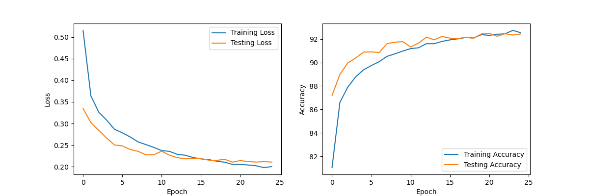
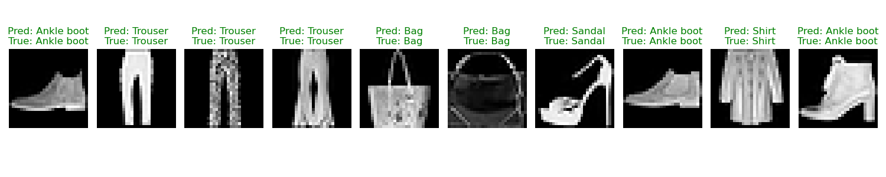

# Fashion-MNIST CNN

A deep learning project implementing a Convolutional Neural Network (CNN) to classify Fashion-MNIST dataset images using PyTorch.

## Overview

This project implements a CNN model to classify fashion items from the Fashion-MNIST dataset. The model architecture includes three convolutional layers with batch normalization and dropout, followed by two fully connected layers.

## Features

- Custom CNN architecture optimized for Fashion-MNIST classification
- Training with early stopping mechanism
- Real-time training progress visualization
- Model checkpointing
- Prediction visualization with comparison to ground truth
- Comprehensive training history plots

## Project Structure

```plaintext

.
├── main.py             # Main execution script
├── src/
│   ├── dataset.py      # Data loading and preprocessing
│   ├── model.py        # CNN model architecture
│   ├── train.py        # Training loop implementation
│   ├── utils.py        # Utility functions
│   └── visualize.py    # Visualization functions
├── models/             # Saved model checkpoints
└── results/            # Training plots and visualizations

```

## Installation

1. Clone the repository:

    ```bash
    git clone https://github.com/yourusername/fashion-mnist-classification.git
    cd fashion-mnist-classification
    ```

2. Install dependencies:

    ```bash
    pip install torch torchvision tqdm matplotlib
    ```

## Usage

Run the training script:

```bash
python main.py
```

The script will:

1. Download and prepare the Fashion-MNIST dataset
2. Train the CNN model
3. Generate training history plots
4. Save model checkpoints
5. Visualize predictions

## Model Architecture

The CNN architecture consists of:

- 3 Convolutional layers with increasing filter sizes (32, 64, 128)
- Batch Normalization after each convolution
- Dropout for regularization
- MaxPooling layers for dimensionality reduction
- 2 Fully connected layers (512 units, 10 output classes)

## Dataset

The Fashion-MNIST dataset includes 10 categories:

```python
class_labels = [
    "T-shirt/top",
    "Trouser",
    "Pullover",
    "Dress",
    "Coat",
    "Sandal",
    "Shirt",
    "Sneaker",
    "Bag",
    "Ankle boot",
]
```

## Results

Training results will be saved in the `results/` directory:

- `training_history.png`: Loss and accuracy curves
- `predictions.png`: Sample predictions with ground truth comparison

The following are the example results:





## License

Copyright &copy; [Xi Xu](https://xi-xu.me). All rights reserved.

Licensed under the [GPL-3.0](LICENSE) license.  
